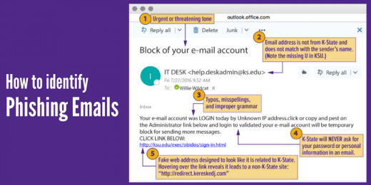

# Phishing-Awareness-Campaign
Development and implementation of a comprehensive phishing awareness campaigns to educate employees on the risks and techniques associated with phishing attacks and design and create visually appealing and informative materials.
# What is phishing?

Phishing is a common scam that attempts to lure you into giving up your username, password, or other sensitive information by masquerading as someone you know and trust. This can be done by phone, but is typically done in email. The email may appear to come from ECSU or another company you do business with, and it often asks you to click a link, open an attachment, or reply with your account or personal information.

Phishing is a type of cyber attack that leverages social engineering techniques. It manipulates you into giving away private information by impersonating a trusted person or company like a bank or colleague.
Phishing attacks can happen via email, phone calls, texts and social media. They are designed to bait you into clicking on a malicious link or opening a malicious file.
A more sophisticated type of phishing attack is known as spear fishing. This attack is targeted towards a specific person, making it more believable and effective.

# Learn to spot phishing emails

  

Urgent call to action or threats - Be suspicious of emails that claim you must click, call, or open an attachment immediately. Often, they'll claim you have to act now to claim a reward or avoid a penalty. Creating a false sense of urgency is a common trick of phishing attacks and scams. They do that so that you won't think about it too much or consult with a trusted advisor who may warn you.

Spelling and bad grammar - Professional companies and organizations usually have an editorial staff to ensure customers get high-quality, professional content. If an email message has obvious spelling or grammatical errors, it might be a scam. These errors are sometimes the result of awkward translation from a foreign language, and sometimes they're deliberate in an attempt to evade filters that try to block these attacks.

Generic greetings - An organization that works with you should know your name and these days it's easy to personalize an email. If the email starts with a generic "Dear sir or madam" that's a warning sign that it might not really be your bank or shopping site.

Mismatched email domains - If the email claims to be from a reputable company, like Microsoft or your bank, but the email is being sent from another email domain like Gmail.com, or microsoftsupport.ru it's probably a scam. Also be watchful for very subtle misspellings of the legitimate domain name. Like micros0ft.com where the second "o" has been replaced by a 0, or rnicrosoft.com, where the "m" has been replaced by an "r" and a "n". These are common tricks of scammers. 

Suspicious links or unexpected attachments - If you suspect that an email message is a scam, don't open any links or attachments that you see. Instead, hover your mouse over, but don't click, the link to see if the address matches the link that was typed in the message.

# How do we stop getting phished?

Verify the sender by checking their email address — WHO sender addresses use the person@who.int pattern. NOT Gmail, etc.

Check the link, before you click — make sure the links start with https:// and not http://

Be careful when providing personal information — never provide your credentials to third parties, not even the WHO.

Do not rush or panic react — scammers use this in order to pressure you into clicking links or opening attachments.

If you gave sensitive information, don’t panic — reset your credentials on sites you've used them. Change your passwords and contact your bank immediately.

Report all scams — Go to https://www.who.int/about/report_scam/en/
